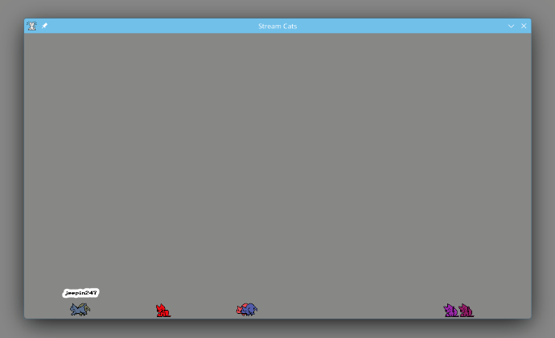

Stream Cats
===========

Small Godot system like Stream Avatars (but FOSS) which uses Oneko cats to
display your Twitch stream chatters on your stream.

Using
-----

Just run it. Press **ESC** to open the configuration menu. Enter your details,
including a manually generated OAUTH token (prefixed with oauth:).

Chat commands:

* !jump - Make your cat jump.
* !sleep - Make your cat go to sleep
* !wake = Wake up your cat again
* !color #rrggbb - Change the color of your cat
* !attack <user> - Challenge another cat to a fight
* !accept - Accept a fight challenge

